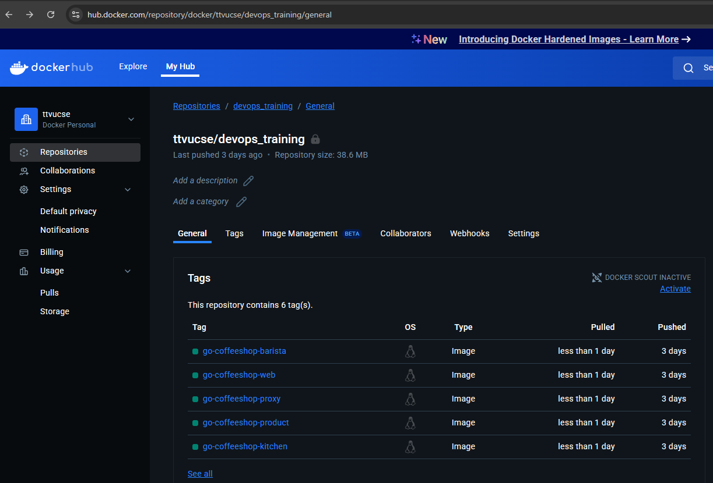
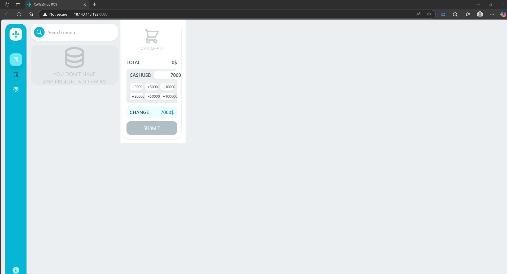

# DevOps Training Project

This project provides an infrastructure-as-code (IaC) solution to deploy the Go CoffeeShop application across development and production environments using Terraform. It leverages modular, reusable Terraform code to provision and manage cloud infrastructure on AWS, including networking, EKS clusters, and Kubernetes resource management for microservices such as barista, kitchen, counter, and product.

## Table of Contents
- [DevOps Training Project](#devops-training-project)
  - [Table of Contents](#table-of-contents)
    - [1. Preparation](#1-preparation)
    - [2. Infrastructure as Code](#2-infrastructure-as-code)
    - [3. Application Deployment](#3-application-deployment)
    - [4. CI/CD](#4-cicd)
    - [5. Monitoring System](#5-monitoring-system)
  - [The Homepage of the Application](#the-homepage-of-the-application)
  - [How to Deploy](#how-to-deploy)
    - [Development Environment](#development-environment)
    - [Production Environment](#production-environment)

### 1. Preparation
- **Infrastructure**: Hosted on AWS, leveraging a personal AWS account for resource management.
- **Code Storage**: The application code and configuration are stored in the GitHub repository at [https://github.com/ttvuisme/devops_training/tree/dev](https://github.com/ttvuisme/devops_training/tree/dev).

### 2. Infrastructure as Code
- **Development Environment**: Managed in `coffeeshop-infra\plat\dev`, using Terraform to provision AWS resources (e.g., EC2 instances).
- **Production Environment**:
  - **EKS Resources**: Defined in `coffeeshop-infra\plat\prod\eks` for provisioning an AWS EKS cluster.
  - **S3 Backend**: Configured in `coffeeshop-infra\bootstrap` for storing Terraform state in an S3 bucket.
- **VPC Module**: A shared VPC module in `coffeeshop-infra\modules` provides networking configuration for both development and production environments.

### 3. Application Deployment
- **3.1 Preparation**:
  - Docker images are pulled locally and pushed to [https://hub.docker.com/repository/docker/ttvucse/devops_training](https://hub.docker.com/repository/docker/ttvucse/devops_training) for distribution.

- **3.2 Development Environment**:
  - **Infrastructure**: Terraform provisions an EC2 instance in the development environment (`coffeeshop-infra\plat\dev`).
  - **Deployment**: Docker Compose is deployed on the EC2 instance, with health check configurations to ensure application availability.
- **3.3 Production Environment**:
  - **EKS Cluster**: Created using Terraform in `coffeeshop-infra\plat\prod\eks`, utilizing the shared VPC module from `coffeeshop-infra\modules`.
  - **In-Cluster Resources**: Managed declaratively using Kubernetes manifests (Deployment and StatefulSet) in `coffeeshop-infra\plat\prod\kubernetes`.
  - **Autoscaling**: Horizontal Pod Autoscaling (HPA) is implemented in `coffeeshop-infra\plat\prod\kubernetes\6-autoscaling`, scaling the web and proxy components based on CPU utilization.
  - **Manifests**: YAML files define all Kubernetes resources (e.g., `deployment.yaml`, `service.yaml`).
- **3.4 Database**:
  - Sensitive data (e.g., database credentials) is stored securely using AWS Secrets Manager.

### 4. CI/CD
- **Status**: CI/CD pipeline implementation is planned but not yet completed. Future integration will use GitHub Actions to automate building, testing, and deploying to EKS.

### 5. Monitoring System
- **Tools**: AWS CloudWatch and CloudWatch Container Insights monitor node CPU usage in the EKS cluster.
- **Alerts**: Configured to trigger notifications if the Horizontal Pod Autoscaler reaches

## The Homepage of the Application


## How to Deploy

### Development Environment

1. Navigate to the development infrastructure directory:
    ```sh
    cd coffeeshop-infra/plat/dev
    ```
2. Initialize Terraform:
    ```sh
    terraform init
    ```
3. Review the planned changes:
    ```sh
    terraform plan
    ```
4. Apply the configuration:
    ```sh
    terraform apply
    ```

### Production Environment

1. **Create the Terraform state bucket:**
    ```sh
    cd coffeeshop-infra/bootstrap
    terraform init
    terraform plan
    terraform apply
    ```
2. **Provision the EKS cluster:**
    ```sh
    cd coffeeshop-infra/plat/prod/eks
    terraform init
    terraform plan
    terraform apply
    ```
3. **Deploy the application to EKS:**
    ```sh
    cd coffeeshop-infra/plat/prod/kubernetes
    ./deploy_all.sh
    ```

4. **Check running pods and port-forward to access the homepage:**

    - List all running pods in the namespace (`coffeeshop-prod`):
      ```sh
      kubectl get pods -n coffeeshop-prod
      ```
    - Port-forward port 8888 from the pod:
      ```sh
      kubectl port-forward svc/web-service 8888:8888 -n coffeeshop-prod
      ```
    - Open browser and navigate to [http://localhost:8888](http://localhost:8888) to view the homepage.